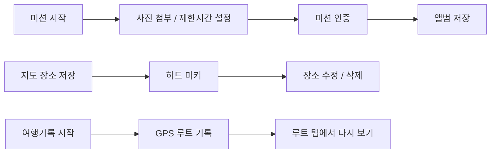

# 프로젝트 개요

## 1. 프로젝트 배경

강아지와 함께 여행을 다니는 커플은 장소를 고를 때부터 기록을 남길 때까지 확인할 것이 많습니다. 애견 동반이 가능한지, 어디서 쉬었는지, 어떤 길로 이동했는지, 그날 찍은 사진이 어느 장소와 이어지는지 따로 관리하면 나중에 다시 보기 어렵습니다.

이 앱은 커플이 강아지와 다닌 여행을 지도 중심으로 남기기 위해 만들었습니다. 둘만의 미션, 애견 동반 장소, 사진, GPS 이동 루트를 한 앱 안에서 이어서 볼 수 있게 한 기록형 앱입니다.

## 2. 프로젝트 목적

- 강아지와 함께 방문하기 좋은 장소를 지도에서 찾고 저장한다.
- 미션과 인증 사진을 한 흐름으로 관리한다.
- 지도 위에 직접 저장한 추억 장소를 남긴다.
- 여행 중 이동 경로를 GPS로 기록하고 나중에 다시 본다.
- 앨범과 미션 성공 사진을 한곳에 모은다.
- 한국어와 일본어 사용자를 모두 고려한다.

## 3. 기대 효과

- 📍 여행 루트를 다시 보며 실제 이동 흐름을 확인할 수 있다.
- 🖼️ 사진과 장소가 함께 저장되어 추억을 찾기 쉽다.
- 🎯 미션 제한시간과 인증 흐름으로 작은 이벤트를 만들 수 있다.
- 🐶 애견 동반 장소 검색으로 데이트 후보 탐색 시간을 줄인다.

## 4. 개발 범위

### 포함 기능
- 메인 화면
- 미션 생성 / 수정 / 삭제 / 인증
- 지도 장소 검색 / 저장 / 수정 / 삭제
- 추천 장소 네이버지도 연동
- 현재 위치 공유
- GPS 여행 루트 기록
- 앨범 다중 사진 업로드
- 한국어 / 일본어 전환

### 제외 기능
- 소셜 로그인
- 공개 커뮤니티
- 결제
- 실시간 채팅
- 관리자 웹 페이지

## 5. 프로젝트 흐름

