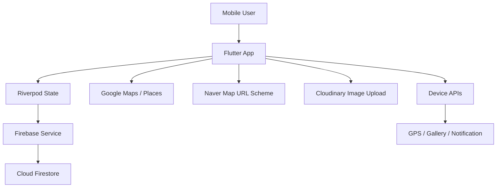
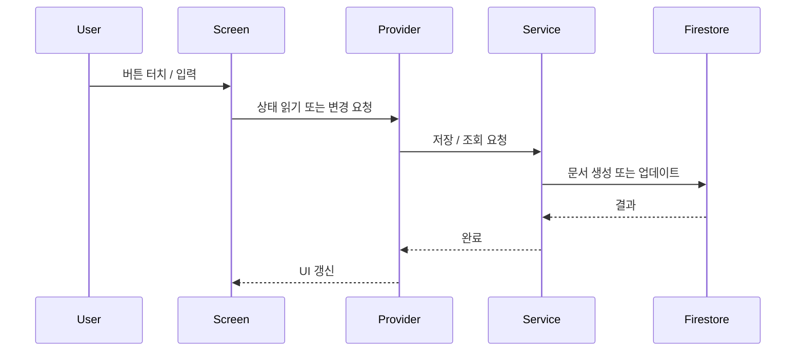

# 시스템 아키텍처

## 전체 구조

## 앱 레이어

| 레이어 | 역할 | 주요 파일 |
|---|---|---|
| Presentation | 화면 렌더링, 사용자 입력 처리 | `features/*/*_screen.dart` |
| State | 화면 상태, 스트림 구독, 사용자 선택값 관리 | `core/providers/*` |
| Service | Firestore, 이미지 업로드, 외부 API 호출 | `core/services`, `core/utils` |
| Shared | 공통 화면 구조, 라우팅 | `shared`, `core/router` |

## 상태 관리

Riverpod을 사용합니다.

- `StreamProvider`: Firestore 실시간 데이터 구독
- `NotifierProvider`: 현재 사용자, 지도 중심 위치, 여행기록 상태 관리
- `Provider`: FirebaseService, SharedPreferences 주입

## 데이터 흐름

## 인증 구조

현재 버전은 로그인 서버를 두지 않고, 두 명의 사용자를 앱 내부에서 전환하는 구조입니다. 포트폴리오 공개용 문서에서는 실제 사용자 식별값 대신 `파트너 A`, `파트너 B`로 설명합니다.

향후 확장 시 Firebase Auth 또는 커스텀 인증 서버를 붙일 수 있습니다.
