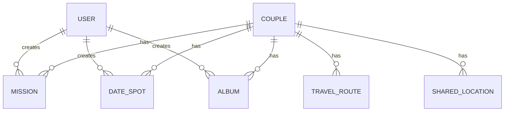

# 데이터베이스 설계서

Firestore를 기준으로 정리했습니다. 실제 프로젝트 ID와 사용자 식별값은 공개 문서에 포함하지 않습니다.

## 컬렉션 구조

```text
couples/{coupleId}
├─ missions/{missionId}
├─ date_spots/{spotId}
├─ travel_routes/{routeId}
├─ albums/{albumId}
└─ shared_locations/{userId}

users/{userId}
```

## ERD



## missions

| 필드 | 타입 | 필수 | 설명 |
|---|---|---|---|
| content | String | Y | 미션 내용 |
| originalImageUrl | String | N | 참고 사진 URL |
| proofImageUrl | String | N | 인증 사진 URL |
| isCompleted | Boolean | Y | 완료 여부 |
| isJoint | Boolean | Y | 공동 미션 여부 |
| winnerId | String | N | 완료 사용자 |
| creatorId | String | Y | 작성자 |
| timestamp | Timestamp | Y | 생성일 |
| deadline | Timestamp | N | 제한시간 |
| completedAt | Timestamp | N | 완료일 |

## date_spots

| 필드 | 타입 | 필수 | 설명 |
|---|---|---|---|
| name | String | Y | 장소명 |
| category | String | Y | 카테고리 |
| address | String | N | 주소 |
| imageUrl | String | N | 장소 사진 URL |
| latitude | Number | Y | 위도 |
| longitude | Number | Y | 경도 |
| creatorId | String | Y | 작성자 |
| timestamp | Timestamp | Y | 생성일 |

## travel_routes

| 필드 | 타입 | 필수 | 설명 |
|---|---|---|---|
| title | String | Y | 루트 제목 |
| creatorId | String | Y | 기록 시작 사용자 |
| startTime | Timestamp | Y | 시작 시각 |
| endTime | Timestamp | N | 종료 시각 |
| totalDistanceMeters | Number | Y | 총 이동거리 |
| points | Array | Y | GPS 포인트 목록 |
| updatedAt | Timestamp | Y | 마지막 저장 시각 |

### route point

| 필드 | 타입 | 설명 |
|---|---|---|
| latitude | Number | 위도 |
| longitude | Number | 경도 |
| timestamp | Timestamp | 기록 시각 |
| accuracy | Number | GPS 정확도 |

## albums

| 필드 | 타입 | 필수 | 설명 |
|---|---|---|---|
| title | String | Y | 앨범 제목 |
| imageUrl | String | Y | 사진 URL |
| creatorId | String | Y | 등록 사용자 |
| placeName | String | N | 장소명 |
| address | String | N | 주소 |
| latitude | Number | N | 위도 |
| longitude | Number | N | 경도 |
| timestamp | Timestamp | Y | 등록일 |

## shared_locations

| 필드 | 타입 | 필수 | 설명 |
|---|---|---|---|
| latitude | Number | Y | 현재 위치 위도 |
| longitude | Number | Y | 현재 위치 경도 |
| updatedAt | Timestamp | Y | 마지막 갱신 시각 |
